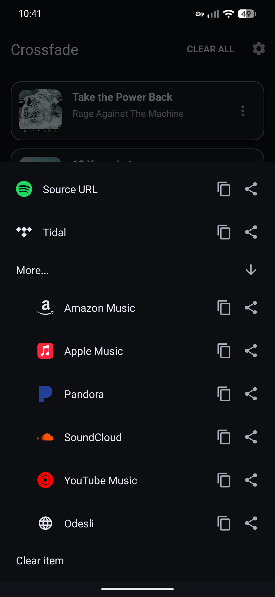

  
  

Crossfade is an Android app that opens any music link in your preferred streaming service - regardless of what your friends use. It seamlessly redirects song and album links from any platform to another, ensuring a smooth listening experience.

## ✨ Features

- **Universal Link Handling**: Support for Spotify, Apple Music, Tidal, Amazon Music, YouTube Music, Deezer, Soundcloud, and more.
- **Smart Redirection**: Uses the Odesli API to find the equivalent track on your preferred service.
- **Fallback Mechanism**: If an exact match isn't found, Crossfade performs a smart search (Title + Artist) to find the best match.
- **Share Sheet Integration**: Redirect links directly from the Android Share Sheet—no more manual copying and pasting.
- **History & Favorites**: Keep track of resolved links for quick access.

## 🛠️ Configuration

To get the most out of Crossfade, set it as your default link handler for the music apps you don't use:

1.  Open **Crossfade** and navigate to **Settings**.
2.  Tap on **"Set As Default"**.
3.  In the System Settings, ensure "Open supported links" is enabled.
4.  Select the domains you want Crossfade to handle (e.g., `open.spotify.com`, `music.apple.com`).

## 📥 Installation

Currently, Crossfade is available as a direct APK download (under Releases), can be built from source or ideally installed from Obtainium to allow for automatic updates.

## 🛡️ Verification

To ensure your Crossfade build is genuine and hasn't been tampered with, you can verify it using [AppVerifier](https://github.com/soupslurpr/AppVerifier).

**Package Name:** `com.blankdev.crossfade`
**SHA-256 Hash:** `D5:69:98:17:CC:CE:5F:F6:0B:8C:4B:1A:FA:A7:E8:A8:61:E3:A6:EA:C0:BF:40:C6:FC:EA:21:0E:FC:57:40:56`

### How to Verify
1. Copy the SHA-256 hash above.
2. In [AppVerifier](https://github.com/soupslurpr/AppVerifier), select **Verify from clipboard**.
3. Choose the installed **Crossfade** app or the APK file.
4. [AppVerifier](https://github.com/soupslurpr/AppVerifier) will confirm if the hashes match.

## 📜 License

This project is licensed under the MIT License - see the [LICENSE](LICENSE) file for details.